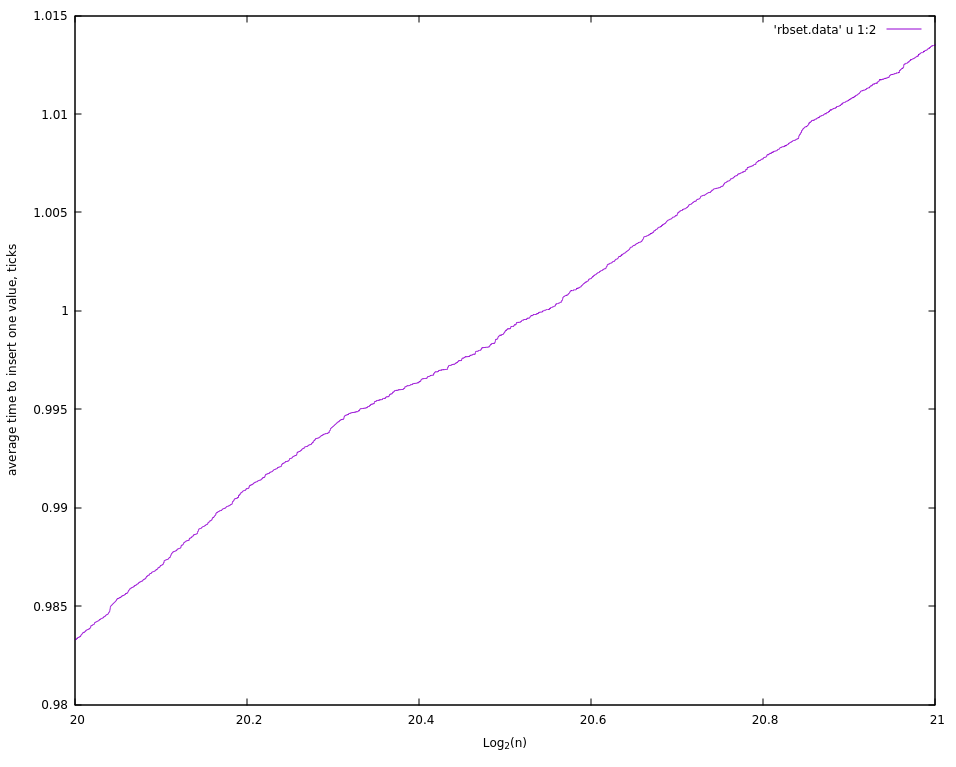

# mipt-trees
Реализации avl и красно-чёрных деревьев для фопфовской лабы.
# Компиляция и исполнение
```sh
$ g++ profiler.cpp -O3 -o profiler && ./profiler
```
Профайлер успешно исполняется в valgrind-е, лог можно посмотреть в valgrind.log.

Для каждого дерева профайлер генерирует файл <название>.data, в который складывает время исполнения одного insert-а, find-а и erase-а в среднем в координатах (ln(n), avg time to do sth). В техминах ассимптотики это график (O(ln(n)), O(ln(n))).

